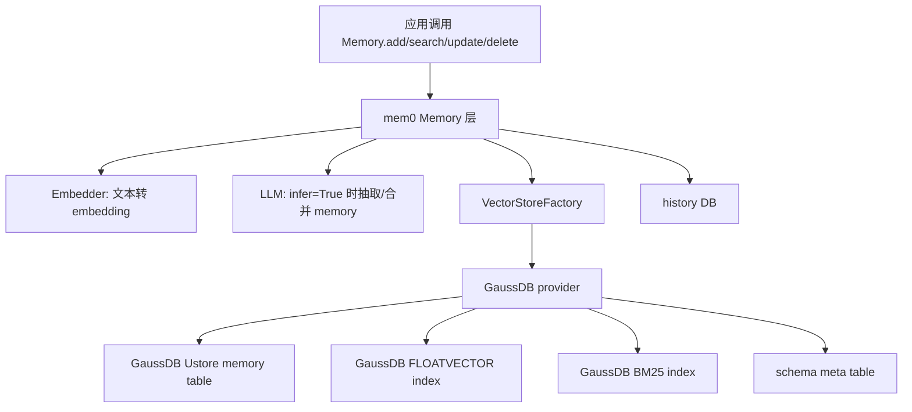
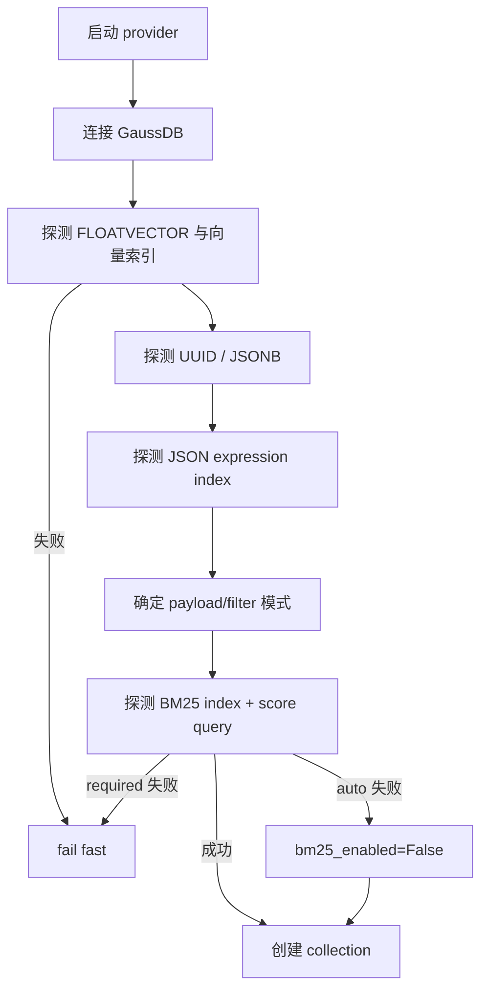

# mem0 GaussDB 适配技术设计文档

> 生成日期：2026-04-28  
> 代码基线：`codex/add-gaussdb-ustore-provider`，当前提交 `463718fc`  
> 设计对象：`mem0.vector_stores.gaussdb.GaussDB` provider 与 `GaussDBConfig`。

## 1. 设计目标

GaussDB provider 的目标不是只把 embedding 写进一张表，而是完整接入 mem0 的 memory 生命周期和检索链路：

- 对齐 `VectorStoreBase` 标准接口。
- 对齐 `Memory.from_config` 到 provider 的初始化链路。
- 支持 semantic vector search、BM25 keyword search 和 batch search。
- 在集中式 A 模式 Ustore 上使用 GaussDB 原生 `FLOATVECTOR`、`gsdiskann`/`gsivfflat`、BM25。
- 商用默认强制 scope filters，防止跨用户、跨 agent、跨 run 泄露 memory。
- 通过能力探测和 fallback 适配 GaussDB 小版本、构建号和 A 模式差异。
- 提供可测试、可观测、可迁移、可运维的实现。

## 2. 总体架构



### 2.1 mem0 执行链路

`Memory.from_config(config)`：

```text
Memory.from_config
  -> MemoryConfig / VectorStoreConfig 校验
  -> EmbedderFactory.create(...)
  -> VectorStoreFactory.create("gaussdb", config)
  -> LlmFactory.create(...)
  -> SQLiteManager(history_db_path)
```

`Memory.add()`：

```text
Memory.add
  -> 组装 user_id / agent_id / run_id / metadata
  -> infer=True 时调用 LLM 抽取 memory facts
  -> embedding_model.embed / embed_batch
  -> vector_store.insert(vectors, payloads, ids)
  -> history DB 写 add 记录
```

`Memory.search()`：

```text
Memory.search
  -> 校验 filters
  -> query lemmatize / entity extract
  -> embedding_model.embed(query)
  -> vector_store.search(query, vector, top_k, filters)
  -> vector_store.keyword_search(query, top_k, filters)
  -> entity store search
  -> semantic + keyword + entity 融合排序
```

GaussDB provider 负责底层存储和召回，最终融合排序仍由 mem0 Memory 层完成。

## 3. 代码结构

| 文件 | 作用 |
|---|---|
| `mem0/vector_stores/gaussdb.py` | Provider 主实现。 |
| `mem0/configs/vector_stores/gaussdb.py` | Pydantic 配置模型。 |
| `mem0/vector_stores/configs.py` | 将 `gaussdb` 纳入 vector store config union。 |
| `mem0/utils/factory.py` | 将 `gaussdb` 注册到 `VectorStoreFactory`。 |
| `tests/vector_stores/test_gaussdb.py` | Mock 单测。 |
| `tests/vector_stores/test_gaussdb_p0.py` | 真实库 P0 验收。 |
| `tests/vector_stores/test_gaussdb_e2e.py` | 真实库 e2e。 |
| `tests/vector_stores/test_gaussdb_quality.py` | 质量、并发和 benchmark。 |

## 4. 配置设计

### 4.1 分层配置

配置分为两层：

- 高层配置：面向普通用户，减少必填项。
- 低层配置：面向 DBA、测试和性能调优。

高层配置：

| 参数 | 值 | 行为 |
|---|---|---|
| `profile=commercial` | 默认 | Ustore、能力探测、scope guard、BM25 auto、`gsdiskann`。 |
| `profile=compatibility` | 可选 | 更保守，倾向 `metadata_mode=compatible` 和 `gsivfflat`。 |
| `metadata_mode=auto` | 默认 | 优先 JSONB + JSON expression filters，失败时 fallback。 |
| `metadata_mode=compatible/text` | 可选 | text payload + redundant scope columns。 |
| `bm25_mode=auto` | 默认 | 尝试 BM25，失败后允许禁用。 |
| `bm25_mode=required` | 可选 | BM25 失败则整体失败。 |
| `bm25_mode=disabled` | 可选 | 禁用 `keyword_search`。 |

低层配置：

| 参数 | 说明 |
|---|---|
| `payload_storage_mode` | `jsonb` 或 `text`，控制 payload 列类型。 |
| `filter_storage_mode` | `json_expression` 或 `redundant_columns`，控制 filters SQL 路径。 |
| `vector_index_type` | `gsdiskann` 或 `gsivfflat`。 |
| `vector_metric` | `cosine` 或 `l2`。 |
| `require_scoped_filters` | 是否强制读路径包含 scope。 |
| `scope_filter_keys` | 可作为 scope 的 key，默认 `user_id/agent_id/run_id`。 |
| `allowed_filter_keys` | 可选 filter key allowlist。 |
| `bm25_*` | BM25 ranking、candidate、dictionary 等参数。 |
| `retry_*` | 瞬态错误重试配置。 |
| `slow_query_ms` | 慢查询日志阈值。 |

### 4.2 连接配置

Provider 支持三种连接来源：

1. 外部传入 `connection_pool`。
2. `connection_string` / `dsn` / `url`。
3. 单项字段或环境变量：
   - `GAUSSDB_HOST`
   - `GAUSSDB_PORT`
   - `GAUSSDB_DATABASE` / `GAUSSDB_DBNAME`
   - `GAUSSDB_USER`
   - `GAUSSDB_PASSWORD`
   - `GAUSSDB_SSLMODE`
   - `GAUSSDB_SSLROOTCERT`

实现使用 GaussDB 官方兼容 `psycopg2` API，避免依赖 psycopg3 特性。

## 5. Schema 设计

每个 mem0 collection 映射为一张 Ustore 主表和一张 schema meta 表。

### 5.1 主表逻辑结构

```sql
CREATE TABLE <collection> (
    id <uuid_or_varchar> PRIMARY KEY,
    vector FLOATVECTOR(<dimension>) NOT NULL,
    payload JSONB | TEXT,
    memory TEXT,
    text_lemmatized TEXT,
    created_at TIMESTAMPTZ,
    updated_at TIMESTAMPTZ,
    schema_version INTEGER DEFAULT 1,
    user_id TEXT NULL,
    agent_id TEXT NULL,
    run_id TEXT NULL
) WITH (storage_type=ustore);
```

说明：

- `payload` 保存 mem0 原始 metadata。
- `memory` 保存展示和回填使用的 memory 原文。
- `text_lemmatized` 保存 BM25 查询字段。
- `user_id/agent_id/run_id` 只在 redundant columns 模式下作为 filter 加速和隔离字段。
- `schema_version` 便于行级演进。

### 5.2 Schema meta 表

```sql
CREATE TABLE <collection>_schema_meta (
    collection_name TEXT PRIMARY KEY,
    schema_version INTEGER NOT NULL,
    payload_storage_mode TEXT NOT NULL,
    filter_storage_mode TEXT NOT NULL,
    metadata_column_mode TEXT NOT NULL,
    vector_index_type TEXT NOT NULL,
    vector_metric TEXT NOT NULL,
    bm25_enabled BOOLEAN NOT NULL,
    updated_at TIMESTAMPTZ NOT NULL
);
```

`col_info()` 会读取该表返回真实 schema version，不再硬编码 `1`。

## 6. 索引设计

### 6.1 向量索引

默认：

```sql
CREATE INDEX <collection>_vector_idx
ON <collection>
USING gsdiskann (vector COSINE);
```

可选：

- `vector_index_type=gsivfflat`
- `vector_metric=l2`

查询算子映射：

| metric | 查询算子 | 索引 metric | 说明 |
|---|---|---|---|
| `cosine` | `<+>` | `COSINE` | 默认，适合常见 embedding 相似度。 |
| `l2` | `<->` | `L2` | 可选，适合欧氏距离。 |

索引构建前可使用：

```sql
SET LOCAL maintenance_work_mem = '128MB';
```

该设置只在当前事务内生效，不修改数据库全局参数。

### 6.2 BM25 索引

BM25 使用 `text_lemmatized` 字段。

设计原则：

- BM25 是增强能力，不是 semantic search 的硬依赖。
- `bm25_mode=auto` 下 BM25 建索引失败不应导致 collection 创建失败。
- BM25 DDL 使用 savepoint 保护，失败后 rollback 到 savepoint。
- `bm25_mode=required` 下 BM25 失败应 fail fast。

默认参数：

| 参数 | 默认值 | 说明 |
|---|---|---|
| `bm25_ranking_metric` | `0` | BM25 OKAPI。 |
| `bm25_ncandidates` | `128` | 候选数量。 |
| `bm25_dictionary` | `None` | 使用数据库默认 dictionary。 |

### 6.3 Filter 索引

`json_expression` 模式：

- payload 为 JSONB。
- filter 通过 JSON expression 提取字段。
- 对高频 scope/filter 字段创建表达式索引。

`redundant_columns` 模式：

- payload 可以是 JSONB 或 TEXT。
- `user_id/agent_id/run_id` 冗余为普通列。
- 对冗余列创建 BTree 索引。
- 这是 A 模式 JSON/表达式索引不可靠时的商用 fallback。

## 7. 能力探测设计

能力探测在 provider 初始化时执行，除非 `enable_capability_probe=False`。

探测项：

| 能力 | 必需 | 失败处理 |
|---|---|---|
| 连接可用 | 是 | fail fast。 |
| `FLOATVECTOR` | 是 | fail fast。 |
| 向量索引 | 是 | fail fast 或切换已配置索引类型。 |
| UUID | 否 | fallback 到 `VARCHAR(36)`。 |
| JSONB payload | 否 | fallback 到 `TEXT`。 |
| JSON expression index | 否 | fallback 到 `redundant_columns`。 |
| BM25 index | 否/按配置 | auto 下禁用 BM25，required 下 fail fast。 |
| BM25 score query | 否/按配置 | auto 下禁用 BM25，required 下 fail fast。 |

探测流程：



## 8. 写入设计

### 8.1 Insert/upsert

`insert(vectors, payloads, ids)` 支持多行批量写入。

设计要求：

- 单事务写入。
- 所有行作为 CTE incoming set 输入。
- 先 set-based `UPDATE` 已存在记录。
- 再 set-based `INSERT` 不存在记录。
- 避免逐行 DML。
- 对每行派生：
  - `memory = payload["data"] or payload["memory"]`
  - `text_lemmatized = payload["text_lemmatized"] or memory`
  - redundant scope columns。

该设计绕开 A 模式下 PostgreSQL `ON CONFLICT` 兼容风险，同时保持批量性能。

### 8.2 Update

`update(vector_id, vector=None, payload=None)` 只更新显式传入字段：

| 输入 | 行为 |
|---|---|
| `vector` 非空 | 更新 `vector`。 |
| `payload` 非空 | 更新 `payload`、`memory`、`text_lemmatized`。 |
| redundant columns 模式 | 只在 payload 显式包含 scope key 时更新对应冗余列。 |
| 任意 update | 刷新 `updated_at`。 |

注意：

- vector-only update 不更新 payload/text 字段，这是显式语义：只替换 embedding。
- 如果业务文本变化，应通过 payload/full update 路径传入新的 `data` 或 `memory`。

### 8.3 Delete/get/list/reset

- `delete(vector_id)` 幂等，删除不存在记录视为成功。
- `get(vector_id)` 按 mem0 标准接口只接收 id，不支持 provider-level filters。
- `list(filters, top_k)` 支持 filters 和稳定排序。
- `reset()` 删除并重建 collection。
- `delete_col()` 删除主表和 schema meta 表，主表索引随表自动删除。

## 9. 检索设计

### 9.1 Semantic search

逻辑 SQL：

```sql
SELECT
    id,
    payload,
    memory,
    vector <operator> %s::FLOATVECTOR AS distance
FROM <collection>
WHERE <filters>
ORDER BY distance ASC, id ASC
LIMIT %s;
```

Provider 将 distance 归一为 mem0 兼容 score：

```text
score = 1 / (1 + max(distance, 0))
```

该公式对 cosine distance 和 l2 distance 都保持“距离越小，score 越大”的方向。不同 metric 的 score 分布范围不同，mem0 上层融合排序按相对分数使用。

### 9.2 Keyword search

逻辑 SQL：

```sql
SELECT
    id,
    payload,
    memory,
    text_lemmatized ### %s AS score
FROM <collection>
WHERE <filters>
ORDER BY score DESC, id ASC
LIMIT %s;
```

行为：

- 空 query 返回 `[]`。
- BM25 禁用返回 `None`，保持 mem0 provider 约定：`None` 表示不支持 keyword search。
- BM25 查询异常时：
  - `bm25_fail_fast=True`：抛出异常。
  - `bm25_fail_fast=False`：记录 fallback metric 并返回 `None`。

### 9.3 Batch search

`search_batch(queries, vectors_list, top_k, filters)` 返回二维结果：

```python
[
    [OutputData(...), OutputData(...)],
    [OutputData(...)]
]
```

设计目标：

- 用一次 SQL 处理多个 query vector，减少 entity store 场景往返。
- 每个 query 保持独立 top-k。
- 原生 batch 失败时 fallback 到逐条 `search`，复用相同 filters 和 scope guard。

## 10. Filter 与租户隔离设计

### 10.1 支持的 filter 形态

支持简单等值、集合、范围和逻辑组合：

```python
{"user_id": "u1"}
{"category": {"eq": "travel"}}
{"priority": {"in": ["high", "medium"]}}
{"created_at": {"gte": "2026-01-01"}}
{"$and": [{"user_id": "u1"}, {"category": "travel"}]}
{"$or": [{"category": "travel"}, {"category": "food"}]}
{"$not": [{"category": "archived"}]}
```

所有 value 参数化传入，所有 key 必须通过 identifier 校验和 allowlist 检查。

### 10.2 Scope guard

商用默认：

```python
require_scoped_filters=True
scope_filter_keys=["user_id", "agent_id", "run_id"]
```

读路径包括：

- `search`
- `keyword_search`
- `search_batch`
- `list`

这些路径必须包含能约束整个查询的正向 scope predicate。

有效例子：

```python
{"user_id": "alice"}
{"$and": [{"user_id": {"eq": "alice"}}, {"category": "travel"}]}
{"agent_id": {"in": ["agent-a", "agent-b"]}}
```

无效例子：

```python
{"$or": [{"user_id": "alice"}, {"category": "public"}]}
{"user_id": {"ne": "alice"}}
{"$not": [{"user_id": "alice"}]}
{"$and": []}
```

原因：

- `$or` 中某个分支有 scope，不代表整个查询被 scope 约束。
- `ne/nin/not` 是负向条件，不能证明只查询某个租户。
- 空逻辑条件不能提供隔离。

## 11. Metadata fallback 设计

早期设计中 `metadata_column_mode` 同时承担 payload 存储和 filter 实现两件事，容易导致 JSONB fallback 到 text 后 filters 不可用。当前设计拆为两个维度：

| 维度 | 参数 | 可选值 |
|---|---|---|
| payload 存储 | `payload_storage_mode` | `jsonb`、`text` |
| filter 实现 | `filter_storage_mode` | `json_expression`、`redundant_columns` |

组合规则：

| payload | filter | 是否允许 | 说明 |
|---|---|---|---|
| `jsonb` | `json_expression` | 是 | 优先模式。 |
| `jsonb` | `redundant_columns` | 是 | JSON payload + scope 冗余列。 |
| `text` | `redundant_columns` | 是 | A 模式兼容模式。 |
| `text` | `json_expression` | 否 | text payload 无法执行 JSON expression filters。 |

## 12. 事务、重试与错误处理

### 12.1 事务边界

- `create_col` 在事务内创建主表、schema meta 和索引。
- 可选 BM25 DDL 使用 savepoint 保护。
- `insert`、`update`、`delete`、`reset` 使用明确 commit/rollback。
- `_get_cursor(commit=True)` 统一管理连接归还。

### 12.2 重试规则

可重试错误包括：

- connection 中断
- timeout
- deadlock
- lock wait
- serialization failure
- server closed connection

不可重试错误包括：

- 输入校验失败
- unsafe identifier
- 不支持 filter operator
- schema/config mismatch
- SQL 语法或类型错误

### 12.3 BM25 fallback

BM25 是增强能力：

- `bm25_mode=auto`：BM25 DDL/query 失败时禁用 keyword search。
- `bm25_mode=required`：失败即抛错。
- `bm25_mode=disabled`：不创建 BM25 索引，`keyword_search` 返回 `None`。

## 13. 迁移与运维设计

### 13.1 Schema version

Provider 使用 collection 级 schema meta 跟踪：

- schema version
- payload/filter 模式
- vector index type
- vector metric
- BM25 状态

`col_info()` 返回真实 schema version 和当前能力信息。

### 13.2 Migration dry-run

`migration_dry_run()` 输出当前 v1 helper 能力：

- 当前 collection 与 schema 状态。
- 需要回填的派生字段。
- 预计影响行数。
- 不会修改数据。
- 对完整跨版本 schema migration 的局限说明。

### 13.3 Backfill

`backfill_derived_fields()` 用于：

- 从 payload/memory 回填 `text_lemmatized`。
- 回填 redundant scope columns。
- 对 text payload 场景报告需要应用层重算的记录。

### 13.4 Analyze

`analyze()` 执行表统计维护，便于优化器选择更稳定的执行计划。

### 13.5 `_ensure_indexes()`

索引确保能力被设计为私有方法，只用于内部建表/修复路径。它只做 `CREATE INDEX IF NOT EXISTS`，不承诺 drop/recreate，也不作为 mem0 标准公共接口暴露。

## 14. 观测设计

Provider 内部维护轻量 metrics：

- operation latency
- fallback count
- retry count
- error count
- BM25 fallback count

日志原则：

- 慢查询超过 `slow_query_ms` 记录 warning。
- 错误日志记录 operation 和脱敏错误分类。
- 不输出 password、token、完整 DSN 或敏感 payload。

## 15. 与现有 provider 对比

| 能力 | pgvector | Qdrant | MongoDB | Elasticsearch/OpenSearch | GaussDB |
|---|---|---|---|---|---|
| 标准 CRUD | 支持 | 支持 | 支持 | 支持 | 支持 |
| SQL/事务 | 支持 | 不适用 | 部分 | 不适用 | 支持 |
| 原生向量索引 | pgvector | Qdrant | Atlas Vector Search | kNN/vector | `FLOATVECTOR` + `gsdiskann/gsivfflat` |
| `keyword_search` | 支持 | 支持 | 支持 | 支持 | 支持 |
| `search_batch` override | 不支持 | 支持 | 不支持 | 不支持 | 支持 |
| 商用 scope guard | 不强制 | 不强制 | 不强制 | 不强制 | 默认强制 |
| 能力探测 fallback | 较少 | 客户端能力固定 | 依赖服务 | 依赖服务 | 支持 |
| JSON fallback | 不突出 | payload 原生 | 文档原生 | 文档原生 | JSONB/TEXT 拆维 fallback |
| BM25 事务保护 | 不突出 | 不适用 | 服务侧 | 服务侧 | savepoint 保护 |
| 真实库能力矩阵 | 较少 | mock 为主 | mock 为主 | 需要服务 | P0/e2e/quality 覆盖 |

结论：

- GaussDB 对齐了 `pgvector` 的 SQL provider 基础能力。
- GaussDB 对齐了 Qdrant 的 `search_batch` 增强能力。
- GaussDB 对齐了 Elasticsearch/OpenSearch 的关键词检索能力。
- GaussDB 额外补齐了商用隔离、A 模式 fallback、Ustore/BM25 事务保护和真实库验收。

## 16. 测试设计

### 16.1 Mock 单测

`tests/vector_stores/test_gaussdb.py` 覆盖：

- 配置默认值和 alias。
- high-level mode 到 low-level mode 映射。
- factory 注册。
- unsafe identifier 拒绝。
- Ustore/vector/BM25/filter index SQL。
- 能力探测 fallback。
- BM25 savepoint。
- batch insert set-based SQL。
- semantic search score normalization。
- scope guard 正反例。
- keyword search。
- batch search fallback。
- update partial payload 和 redundant columns 保留。
- transaction rollback。
- schema version 读取。
- migration/backfill report。

### 16.2 Live P0

`tests/vector_stores/test_gaussdb_p0.py` 覆盖真实 GaussDB：

- `Memory.from_config` 上层链路。
- provider CRUD、upsert、update、delete。
- scope search/list/batch 隔离。
- JSON filter operator matrix。
- compatibility profile。
- UTF-8 中文和中英混合 round trip。
- cosine/l2 metric。
- native batch 与 sequential 一致性。
- collection operations。
- migration/backfill。
- BM25 keyword search。
- index/metric matrix。

### 16.3 E2E 和质量测试

`test_gaussdb_e2e.py`：

- 用较少用例串起 Ustore、vector、BM25、CRUD、batch。
- 验证 redundant scope partial update。

`test_gaussdb_quality.py`：

- 固定质量回放。
- 并发操作。
- benchmark 报告。

### 16.4 已执行结果

```text
pytest tests/vector_stores/test_gaussdb.py \
       tests/vector_stores/test_gaussdb_p0.py \
       tests/vector_stores/test_gaussdb_e2e.py \
       tests/vector_stores/test_gaussdb_quality.py -q

96 passed, 1 skipped
```

真实库 P0：

```text
pytest tests/vector_stores/test_gaussdb_p0.py -q

22 passed
```

## 17. 使用示例

### 17.1 环境变量

```powershell
$env:GAUSSDB_HOST="<host>"
$env:GAUSSDB_PORT="19995"
$env:GAUSSDB_DATABASE="<database>"
$env:GAUSSDB_USER="<user>"
$env:GAUSSDB_PASSWORD="<password>"
```

### 17.2 mem0 配置

```python
from mem0 import Memory

memory = Memory.from_config({
    "vector_store": {
        "provider": "gaussdb",
        "config": {
            "collection_name": "mem0_memories",
            "embedding_model_dims": 1536,
            "profile": "commercial",
            "metadata_mode": "auto",
            "bm25_mode": "auto",
        },
    },
    "embedder": {
        "provider": "openai",
        "config": {
            "model": "text-embedding-3-small",
            "api_key": "<api-key>",
        },
    },
    "llm": {
        "provider": "openai",
        "config": {
            "model": "gpt-4o-mini",
            "api_key": "<api-key>",
        },
    },
})
```

### 17.3 写入与检索

```python
memory.add(
    "用户喜欢早晨喝拿铁咖啡，出差时优先选择靠窗座位。",
    user_id="user-001",
    agent_id="travel-agent",
    run_id="run-20260428",
)

result = memory.search(
    "帮用户安排明早的航班和早餐",
    filters={"user_id": "user-001"},
    top_k=5,
)
```

## 18. 分布式兼容模式

当前 provider 增加了显式部署形态配置：

| 参数 | 默认值 | 说明 |
|---|---|---|
| `deployment_mode` | `centralized` | `centralized` 或 `distributed`。 |
| `distribution_mode` | `auto` | `auto` 在集中式下解析为 `none`，在分布式下解析为 `hash`。 |

当 `deployment_mode="distributed"` 且 `distribution_mode="auto/hash"` 时，建表 DDL 会追加分布式子句：

```sql
CREATE TABLE <collection> (...) WITH (storage_type=ustore)
DISTRIBUTE BY HASH ("id");

CREATE TABLE <collection>_schema_meta (...) WITH (storage_type=ustore)
DISTRIBUTE BY HASH ("collection_name");
```

选择 `id` 作为主表分布键的原因是：当前 mem0 标准 provider 接口里 `get/update/delete/upsert` 都以 `id` 为稳定主键，`DISTRIBUTE BY HASH ("id")` 能保持主键约束和 DML 语义简单，避免为了分布键改写 mem0 公共接口。

这个实现定位是“分布式兼容模式”，不是最终“分布式性能优化模式”。它可以验证分布式库上的建表、写入、向量检索、BM25、filter 和 collection 生命周期；但对于大规模多租户检索，`user_id/agent_id/run_id + vector top-k` 查询仍可能跨 DN 扫描。后续如果要做商用性能优化，应引入 `scope_hash` 或 scope 映射表，并同步改造主键、upsert、get/update/delete、批量检索和迁移方案。

## 19. 已知限制与后续演进

| 限制 | 当前处理 | 后续方向 |
|---|---|---|
| `get(id)` 无 filters | 文档明确 provider-level 无法 scope。 | Memory/API 层增加 scoped get。 |
| 完整 migration framework 尚未实现 | 提供 v1 dry-run/backfill helper。 | 增加 schema inspector、可执行 plan、rollback plan。 |
| BM25 多语言质量需要业务语料校验 | 默认使用 GaussDB 参数 + 质量回放。 | 建立中文、英文、中英混合 benchmark。 |
| 分布式当前为兼容模式 | `DISTRIBUTE BY HASH ("id")`，不改变 mem0 标准接口。 | 评估 `scope_hash` 分布、全局 top-k 代价和数据倾斜。 |
| 全仓测试依赖大量可选 SDK | GaussDB 测试单独可跑。 | CI matrix 按 provider extras 拆分。 |
| 大规模性能数据仍依赖目标环境 | 提供 benchmark 报告入口。 | 在商用规格环境建立 P95 门禁。 |

## 20. 设计结论

GaussDB provider 当前设计可以作为 mem0 的生产级 SQL/vector provider：

- 标准接口完整。
- 增强接口覆盖 `keyword_search` 和 `search_batch`。
- 与 `pgvector` 在基础生命周期上对齐。
- 与 Qdrant 在 batch search 上对齐。
- 与 Elasticsearch/OpenSearch 在 keyword search 上对齐。
- 在 GaussDB 商用场景额外提供 Ustore、A 模式 fallback、scope guard、能力探测、BM25 事务保护和真实库验收。

后续工作重点不是补齐基础接口，而是围绕商用交付继续加强：

- 更完整的 migration framework。
- 更明确的 scoped `get` 上层契约。
- 更多真实业务语料质量回放。
- 大规模性能和稳定性门禁。
